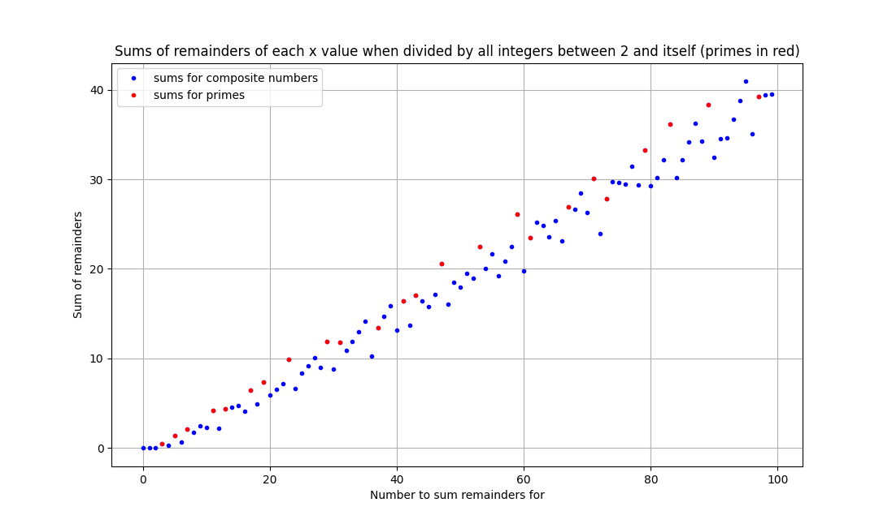
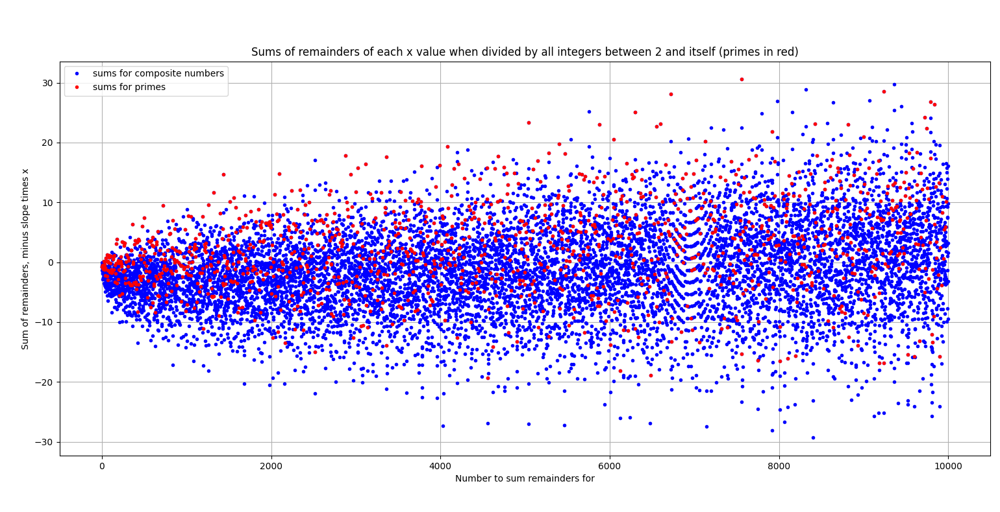
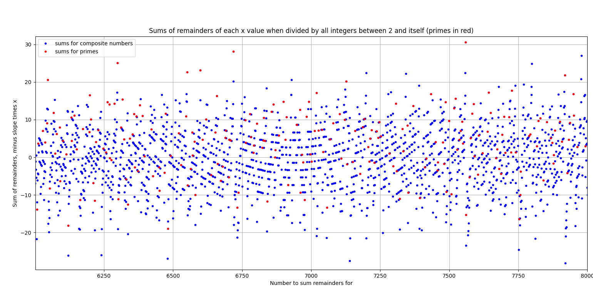

# Sums of remainders #

This program calculates sums of all remainders of integers divided by integers smaller than them. This is calculated up to N, such that for all integers the sum is plotted with prime numbers being marked with a red dot and composite numbers with a blue dot.

The summation for each integer from 2 to N works as:

$X_N = \sum\limits^{N-1}_{i=2} \frac{N}{i} - \lfloor \frac{N}{i} \rfloor$.

The sums are relatively close to each other in terms of the x index, so the slope of the sums can be subtracted from the sums to create a new x axis representing average sum per integer. It is calculated as

$\frac{1}{a} \sum\limits^N_{i=2} X_i$,

where a is a total number of additions to all sums combined, for each i. The resulting slope is therefore the average remainder. 

For example, summing the remainders for number 5 goes like this: 

$X_5 = (\frac{5}{2} - 2) + (\frac{5}{3} - 1) + (\frac{5}{4} - 1) \\
= ~1.41666...$

## Running the code ##

This program takes two command line arguments - number of integers to sum, and whether or not to normalize the plot by the slope. It also prints the slope for all numbers, primes only, and for comparison with $\pi - e$ (~0.423) and the difference between the slope for primes and the $\pi - e$ difference, which the slope for primes gets very close to. 

To run the program, write

`python remaindersums.py 100 0`,

which produces a following plot of sums up to 100 with no normalization:

To display a normalized plot, write for example

`python remaindersums.py 10000 1`,

which produces a following plot with values centered around 0 in the y axis: 

Notice the wavy area near number 7000. Zooming in on the area reveals the structure more:

## Key findings ##

To conclude, the interesting observations here are the fact that the slope for prime number remainder sums is extremely close to $\pi - e$, and the wavy areas which appear in the plots - the one around 7000 being the most prominent thus far. 

